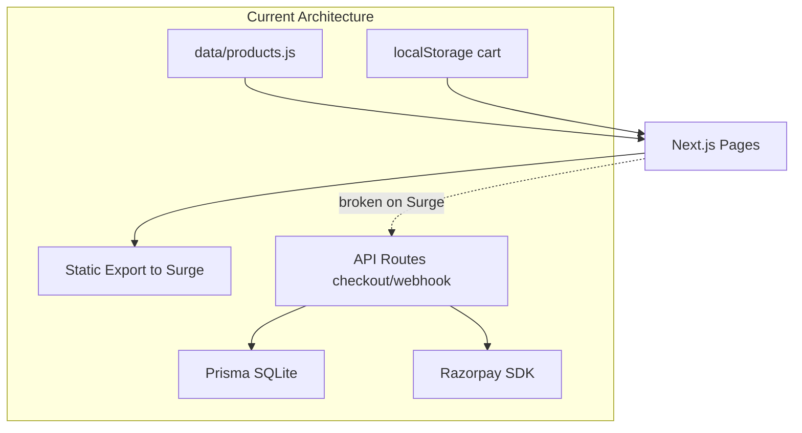

# Naik Foods Website — Comprehensive Audit & Recommendations

## Context

This codebase ([README.md](README.md)) is a **Next.js 16 UX prototype** for [Naik Foods](https://www.naikfoods.co.in) — an authentic Maharashtrian packaged-foods brand (masalas, pickles, snacks, sweets) with an 86+ year legacy. It is **not a full production store**; it demonstrates conversion improvements over the live site while using a **mock catalog of 18 products** ([data/products.js](data/products.js)) deployed as a **static export** to Surge.

**Live demo:** https://naik-foods-improved-demo.surge.sh

---

## What Already Works Well

The prototype successfully addresses several real friction points identified in the original site analysis:

| Strength | Where |
|----------|-------|
| Global search modal with popular fallback | [components/SearchModal.js](components/SearchModal.js) |
| Quick View without full page navigation | [components/QuickViewModal.js](components/QuickViewModal.js) |
| Bundle cross-sell on PDP | [components/BundleSuggestions.js](components/BundleSuggestions.js) |
| Free-shipping gamification | [components/FreeShippingBar.js](components/FreeShippingBar.js), [context/CartContext.js](context/CartContext.js) |
| Recently viewed persistence | [components/RecentlyViewed.js](components/RecentlyViewed.js) |
| Multi-step checkout UX | [app/checkout/page.js](app/checkout/page.js) |
| Pincode delivery check (simulated) | [app/products/[slug]/ProductDetailClient.js](app/products/[slug]/ProductDetailClient.js) |
| Product variants (2 products) | [data/products.js](data/products.js) |
| Cohesive vanilla CSS design system | [app/globals.css](app/globals.css) (~2,050 lines) |
| WhatsApp support FAB | [app/layout.js](app/layout.js) |
| Basic SEO: sitemap, robots, JSON-LD on home/PDP | [app/sitemap.js](app/sitemap.js), [app/robots.js](app/robots.js) |

The visual design is cleaner and more conversion-focused than many sections of the live site. The cart drawer, trust bar, and category navigation create a modern e-commerce feel appropriate for a D2C food brand.

---

## Critical Issues (Not Working / Broken)

### P0 — Blocks real commerce

1. **Static export vs. API routes conflict**
   - [next.config.mjs](next.config.mjs) sets `output: 'export'`, but checkout depends on `/api/checkout` and `/api/webhooks/razorpay`.
   - On Surge, payment initialization **will fail** — the README still describes a "mock checkout timeout" while code now calls Razorpay.
   - **Fix:** Choose one path — either (a) remove static export and deploy to Vercel/Railway with a real DB, or (b) keep static front-end and move checkout to a separate backend/API.

2. **Checkout address and payment method are non-functional**
   - Address inputs in [app/checkout/page.js](app/checkout/page.js) are uncontrolled — data is never captured or sent to the API.
   - UPI / Card / COD radio buttons are cosmetic; all paths open Razorpay. COD is not implemented.
   - Prefill is hardcoded (`test@example.com`, `9999999999`).

3. **Payment security gaps**
   - [app/api/checkout/route.js](app/api/checkout/route.js) accepts client-sent prices without server-side validation against a product catalog.
   - No server-side verification of Razorpay payment signature on client success callback.
   - Mock webhook secret bypasses HMAC verification entirely.

4. **Product catalog is a stub**
   - Only **18 products** in code vs. **115+** claimed on store hero ([app/store/page.js](app/store/page.js)) and category metadata ([data/products.js](data/products.js) line 2).
   - Prisma `Product` model exists but is **never used** — orders reference product IDs that aren't validated.

### P1 — Trust and policy inconsistencies

| Issue | Location | Impact |
|-------|----------|--------|
| Shipping fee ₹50 vs ₹60 | [context/CartContext.js](context/CartContext.js) vs [app/policies/page.js](app/policies/page.js) | Checkout surprise, legal/trust risk |
| FSSAI marked "(Placeholder)" | [app/contact/page.js](app/contact/page.js) | Undermines food-safety credibility |
| Identical nutrition/allergen text on all products | [data/products.js](data/products.js) via `add_fssai.py` | Compliance and customer trust risk |
| Generic social links (`instagram.com`) | [components/Footer.js](components/Footer.js) | Broken brand discovery |
| JSON-LD org URL = `naikfoods.co.in` but site = `surge.sh` | [app/page.js](app/page.js) vs [app/layout.js](app/layout.js) | SEO confusion, rich-result mismatch |
| `--primary` CSS variable used but undefined | Contact page + [app/globals.css](app/globals.css) | Broken link styling |

---

## User Experience — What Can Be Improved

### Discovery and browsing

- **Homepage lacks emotional storytelling** present on live site: hero carousel, "Visit Our Store" CTA, promotional banners, Instagram feed, customer testimonials, newsletter signup.
- **No filters beyond category** — missing price range, brand, region (Vidarbha/Konkan), dietary tags (vegan, no onion-garlic), spice level, weight/size.
- **Category URL doesn't sync** — `/store?category=X` works on load but changing category pills doesn't update the URL (no shareable filtered views).
- **Search is name/brand/tags only** — no fuzzy matching, typo tolerance, or "did you mean" suggestions.
- **No compare, wishlist, or save-for-later** — common for repeat grocery buyers.
- **Load-more pagination** on store feels dated vs. infinite scroll or proper page numbers for SEO.

### Product detail pages

- **Pincode check is a heuristic** (first digit of pincode) — users will discover false positives/negatives at checkout.
- **Reviews are static mock data** — star ratings and review counts aren't real; no review submission, photos, or verified purchase badges.
- **Variants only on 2 of 18 products** — inconsistent UX.
- **Missing:** ingredients list quality, storage instructions, shelf life, batch/expiry info, serving suggestions, recipe pairings, "frequently bought together" beyond bundles.
- **No stock urgency** — "Only 3 left" or "Back in stock alerts" would help conversion for regional specialties.

### Cart and checkout

- **No coupon/promo code field** — live site runs sales (e.g., 10% off snacks & pickles).
- **No order summary email/SMS** after purchase.
- **No guest order tracking** — "Where is my order?" flow missing.
- **No saved addresses** for returning customers.
- **Mobile checkout form** uses 2-column grid without breakpoint override — cramped on small screens.
- **Error handling uses `alert()`** — poor UX vs. inline toast/banner errors.

### Accessibility and polish

- **Emoji as icons** (🔍, 🛒, trust bar) — inconsistent rendering, poor screen-reader semantics vs. SVG + `aria-label`.
- **No custom 404 page** — `notFound()` called but no [app/not-found.js](app/not-found.js).
- **No loading/error boundaries** — no `loading.js` or `error.js` for graceful states.
- **Header logo is "NF" text** — weak brand recognition vs. real logo asset.
- **No favicon or app icons** in [public/](public/).

---

## Developer Perspective — What Can Be Optimized

### Architecture

- **Split concerns:** Front-end (SSG/ISR) + headless CMS (Sanity/Shopify) + serverless API for orders/payments.
- **Single source of truth for products:** Migrate [data/products.js](data/products.js) → Prisma/Postgres or CMS; use `generateStaticParams` + ISR for PDPs.
- **Environment hygiene:** Add `.env.example` documenting `DATABASE_URL`, `RAZORPAY_*`, shipping API keys.
- **PrismaClient singleton** — avoid connection exhaustion under serverless.

### Performance

- **2,050-line monolithic CSS** — consider CSS modules or scoped splits per route to reduce unused CSS.
- **`output: 'export'` forces `images.unoptimized: true`** — all product images load full Cloudinary URLs without responsive srcset; add Cloudinary transforms (`w_400`, `q_auto`, `f_auto`).
- **Homepage is fully client-rendered** ([app/page.js](app/page.js) has `"use client"`) — loses SSR benefits for LCP and SEO; refactor to Server Component with client islands.
- **No caching strategy** — add `revalidate` for product pages if backed by CMS.
- **Razorpay script** loaded on checkout only (good) but no preconnect to `checkout.razorpay.com`.

### Code quality and reliability

- **No TypeScript** — product shape, cart items, and API payloads are untyped.
- **No input validation** (Zod/Yup) on API routes.
- **No tests** — zero unit, integration, or E2E coverage.
- **No CI/CD** — no GitHub Actions for lint, build, or deploy.
- **No rate limiting** on checkout/webhook endpoints.
- **No structured logging or error monitoring** (Sentry, etc.).

### Security checklist before production

- Server-side price recalculation on checkout
- Razorpay payment signature verification server-side
- Webhook signature always enforced (no mock bypass in prod)
- CSRF protection for state-changing routes
- Sanitize and validate all address/payment inputs
- Remove hardcoded test credentials from source

---

## What's Missing vs. Live Site (naikfoods.co.in)

Features on the **production site** that the prototype lacks:

| Feature | Live site | Prototype |
|---------|-----------|-----------|
| Full product catalog (~115+ SKUs) | Yes | 18 mock items |
| Hero carousel / promotions | Yes | Single static hero |
| Instagram feed embed | Yes | Generic footer link |
| Customer testimonials | Yes (6 reviews) | Mock star counts only |
| Newsletter / email capture | Yes | None |
| Blog / recipe articles | Yes | "Coming Soon" link |
| Store locator / visit shop CTA | Yes | Links to contact page |
| Sale banners (10% off) | Yes | None |
| Functional add-to-cart on live catalog | Yes | Prototype-only catalog |

Features the **prototype adds** that live site may lack (keep these):

- Global search modal
- Quick View
- Bundle suggestions
- Free-shipping progress bar
- Recently viewed
- Pincode check (needs real API)
- Cleaner discount badge logic

---

## New Feature Ideas (Creative / Growth-Oriented)

### Conversion and AOV

- **Regional gift boxes** — "Vidarbha Starter Kit", "Konkan Pickle Collection" with bundle pricing (extend [components/BundleSuggestions.js](components/BundleSuggestions.js)).
- **Subscription boxes** — monthly masala/pickle/snack box for NRIs and Pune expats.
- **Corporate gifting** — bulk orders for Diwali, corporate hampers with custom branding.
- **"Complete the recipe" bundles** — masala + base ingredients for a specific dish (e.g., Misal, Puran Poli).
- **Minimum order nudges** — "Add ₹X more for free shipping" already exists; add "Add ₹Y for 10% off".

### Engagement and retention

- **Recipe hub** — SEO-rich content tying products to Aaji's recipes (matches live site positioning).
- **Loyalty points** — earn on purchase, redeem on next order.
- **Referral program** — "Share with a friend, both get ₹100 off".
- **WhatsApp reorder** — one-tap reorder link via WhatsApp Business API.
- **Back-in-stock notifications** — email/WhatsApp when regional favorites return.

### Trust for food e-commerce

- **FSSAI badge** with link to verification (once real license confirmed).
- **Batch traceability** — "Packed on [date], best before [date]".
- **Video on PDP** — kitchen/production B-roll (strong for artisan food brands).
- **Regional origin map** — interactive map showing Vidarbha, Konkan, Marathwada sourcing.

### Operational

- **Admin dashboard** — orders, inventory, promotions (Shopify Admin, Medusa, or custom Next.js admin).
- **Shiprocket/Delhivery integration** — real pincode serviceability, tracking, label generation.
- **Inventory sync** — prevent overselling limited-batch items.

---

## SEO & Traffic Acquisition

### Technical SEO fixes (quick wins)

- Add `generateMetadata` to home, store, and all PDPs (unique title, description, OG image per product).
- Include `/about`, `/contact`, `/policies` in [app/sitemap.js](app/sitemap.js).
- Add Twitter/X card metadata.
- Add canonical URLs per page.
- Add `BreadcrumbList` JSON-LD on store and PDP.
- Fix domain consistency in structured data (demo vs. production).
- Add favicon, apple-touch-icon, web manifest.
- Remove `/checkout` from sitemap (non-indexable transactional page).

### Content SEO (medium-term)

- **Regional long-tail keywords:** "authentic Kolhapuri masala online", "Maharashtrian pickle delivery Pune", "Vidarbha snacks buy online".
- **Recipe blog** with schema markup (`Recipe`, `HowTo`) linking to product pages.
- **Location pages:** "Maharashtrian food delivery in Mumbai/Bangalore" for inter-city shipping.
- **FAQ pages** with `FAQPage` schema — shipping, storage, authenticity, FSSAI.

### Local and social traffic

- **Google Business Profile** optimization for Kothrud Pune store (live site promotes in-person visits).
- **Instagram shopping** — product tags linking to PDPs; embed feed on homepage like live site.
- **YouTube** — recipe shorts driving to product bundles.
- **WhatsApp catalog** — sync product catalog for conversational commerce (huge in India D2C food).

### Performance as SEO

- Target Core Web Vitals: optimize LCP (hero image), reduce CLS (product grid), improve INP (cart interactions).
- Responsive Cloudinary images with lazy loading below fold.

### Analytics and optimization loop

- Add **GA4 + Google Search Console** + optional **Meta Pixel**.
- Heatmaps (Hotjar/Clarity) on checkout funnel to find drop-off.
- A/B test: free-shipping threshold messaging, bundle placement, hero CTA copy.

---

## Recommended Priority Roadmap

### Phase 0 — Make it real (1–2 weeks)
- Resolve static export vs. API conflict; deploy with server support
- Wire full product catalog (CMS or DB migration)
- Server-side price validation + payment verification
- Fix shipping fee, FSSAI, social links, metadata domain mismatches
- Add `.env.example`, error boundaries, custom 404

### Phase 1 — Match production parity (2–4 weeks)
- Real pincode/shipping API (Shiprocket)
- Order confirmation email (Resend/SendGrid)
- User accounts + order history (optional: phone OTP login)
- Promo codes and sale banners
- Product reviews (or import from existing channels)
- Analytics instrumentation

### Phase 2 — Differentiate and convert (4–8 weeks)
- Homepage: testimonials, Instagram, newsletter, hero carousel
- Advanced filters, URL-synced category state
- Gift boxes, subscriptions, recipe bundles
- Admin panel for inventory/orders
- Performance: image optimization, Server Components refactor

### Phase 3 — Growth engine (ongoing)
- Recipe/blog content program
- Local SEO + location landing pages
- Referral/loyalty programs
- WhatsApp commerce integration
- Corporate gifting portal

---

## Summary Verdict

| Lens | Assessment |
|------|------------|
| **As a UX prototype** | Strong — demonstrates meaningful conversion improvements with polished UI patterns |
| **As a production store** | Not ready — architectural conflict, mock data, incomplete checkout, security gaps |
| **vs. live naikfoods.co.in** | Better shopping UX in places, but missing catalog depth, content marketing, social proof, and promotions |
| **Biggest opportunity** | Combine prototype's conversion UX with live site's catalog, content, and trust signals — then add regional storytelling, subscriptions, and WhatsApp-native commerce to stand out in Maharashtrian D2C |

The highest-leverage next step is **unblocking the backend** (deployment model + real catalog + secure checkout), then **closing the trust gap** (consistent policies, real reviews, FSSAI, social links), followed by **content-led SEO** (recipes, regional keywords) to drive organic traffic beyond paid ads.
