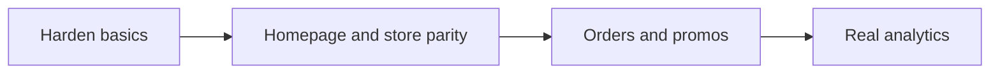

# What's Next After P0/P1

## Verification (confirmed)

Your claimed fixes check out on `main` (`be0c523`):

- [`next.config.mjs`](next.config.mjs): `output: 'export'` removed
- [`app/api/checkout/route.js`](app/api/checkout/route.js): server-side price recalculation, address validation, COD path
- [`app/checkout/page.js`](app/checkout/page.js): controlled address state, working payment radios, real Razorpay prefill
- Shipping fee **₹60** in cart + policies; FSSAI placeholder removed; brand social URLs; `--primary` defined
- Prisma `Product` has rating/reviews/discount/variants/tags; seed restores them; `generateMetadata` on PDPs

**Still thin (not blockers, but note):** catalog is still **18 SKUs** (not 115+), shipping API is still a mock heuristic, GA4 is still `G-XXXXXXXXXX`, no `.env.example` / `not-found.js` / client payment signature verify.

---

## Recommended next phase

Focus on **production hardening + conversion parity** — the highest leverage leftover from the original audit Phase 1–2, without boiling the ocean on subscriptions/admin yet.

### 1. Production hardening (quick)

- Add [`.env.example`](.env.example) documenting `DATABASE_URL`, `RAZORPAY_KEY_ID`, `RAZORPAY_KEY_SECRET`, `RAZORPAY_WEBHOOK_SECRET`
- Add [`app/not-found.js`](app/not-found.js) and [`app/error.js`](app/error.js)
- Extract a Prisma singleton (`lib/prisma.js`) and reuse it in pages/API routes (avoid connection churn)
- Add `POST /api/checkout/verify` to HMAC-verify Razorpay `order_id` + `payment_id` + `signature` before marking PAID / showing success (today the client success handler trusts Razorpay’s browser callback alone)
- Update [`README.md`](README.md) for non-static deploy (`next start` / Vercel) and seed (`node prisma/seed.mjs`)

### 2. Homepage / store parity with live site

- **Promo banner strip** on home + store (e.g. “10% off Traditional Snacks & Pickles”) wired to a simple promo code
- **Instagram section** on home (link grid or embed to `@naikfoods`) — replace “Blog coming soon” footer link with a real `/blog` stub page or recipes teaser
- **Store URL sync**: updating category pills writes `?category=` via `router.replace` in [`app/store/StoreClient.js`](app/store/StoreClient.js)
- **Basic filters**: price range + region (data already has `region`) beside category pills
- Keep testimonials/newsletter; wire newsletter to a stub `POST /api/newsletter` that validates email and logs (or stores in SQLite `Subscriber` model)

### 3. Orders and promos

- **Promo codes**: `PROMO10` / festive code — validate in checkout API, apply % off server-side before shipping calc
- **Order confirmation**: after COD success or verified Razorpay payment, show clear confirmation + optional `mailto:` / Resend stub for confirmation email
- **Guest order lookup**: simple `/orders/track` page — email + order ID lookup against Prisma `Order`

### 4. Analytics that actually measure

- Replace placeholder GA4 ID with env `NEXT_PUBLIC_GA_ID`
- Fire events: `add_to_cart`, `begin_checkout`, `purchase` (with server-calculated total)
- Keep script out of layout when env is unset (no broken `G-XXXXXXXXXX` in prod)

### Explicitly defer (Phase 3+)

Leave for a later pass unless you ask otherwise:

- Expanding catalog to 115+ SKUs from live site scrape/CMS
- Real Shiprocket/Delhivery credentials
- Auth / saved addresses / admin dashboard
- Subscriptions, gift boxes, referral program, WhatsApp catalog sync
- Recipe blog content program

---

## Key files to touch

| Area | Files |
|------|-------|
| Harden | `lib/prisma.js` (new), `app/api/checkout/verify/route.js` (new), `app/not-found.js`, `app/error.js`, `.env.example`, `README.md` |
| Parity | [`app/HomeClient.js`](app/HomeClient.js), [`app/store/StoreClient.js`](app/store/StoreClient.js), [`components/Footer.js`](components/Footer.js), new promo/Instagram components |
| Orders | [`app/checkout/page.js`](app/checkout/page.js), [`app/api/checkout/route.js`](app/api/checkout/route.js), new track page + promo validation |
| Analytics | [`app/layout.js`](app/layout.js), cart/checkout event helpers |

## Success criteria

- Local `npm run build` + `npm start` serves APIs and checkout (COD + Razorpay mock)
- Category filter is shareable via URL; promo code changes server total
- Payment success only after server signature verify (non-mock keys)
- GA events fire only when a real measurement ID is configured
- No remaining P0/P1 regressions (shipping ₹60, variants/ratings, COD path)
